# The Hike Style's

## Introduction
The Hike Style’s is a site about a social community among people who want to practice outdoor sports between nature and who want to share incredible and unique moments. The site is aimed at people who are adventurous and who want to know nature in interesting places , which where the interest in making new friends and making social encounters is the most important. The Hike Style’s will be useful as a reference for those looking for information on Hike and biking in nature.

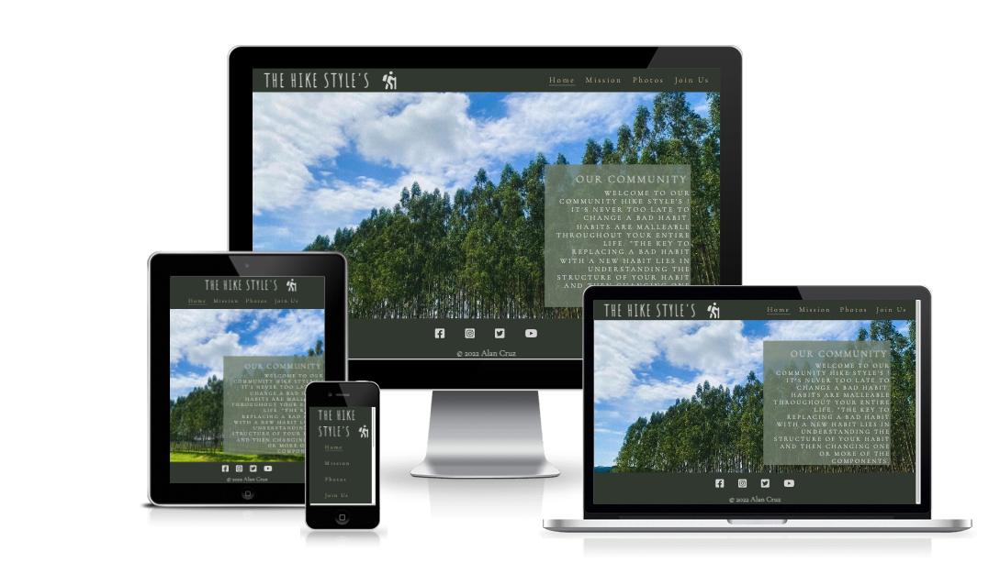

[View the live Website on Github Pages](https://llancruzz.github.io/hike-style/) Please note: To open any links in this document in a new browser tab, please press CTRL + Click.

## Table Of Contents:
* [UX](#ux)

  * [The Hike Style's](#the-hike-style's) 
  * [Colour Palette](#colour-palette)
  * [Wireframe mockups](#wireframe-mockups)
    
    * [Home page Wireframe](#home-page-wireframe)
    * [Mission page Wireframe](#mission-page-wireframe)
    * [Photos page Wireframe](#photos-page-wireframe)
    * [Join Us page Wireframe](#join-us-page-wireframe)
    * [Thank You page Wireframe](#thank-you-page-wireframe)

* [Features](features)
 
  * [Commom Features](#commom-features)
    
    * [Navigation Bar](#navigation-bar)
    * [Hero Image](#hero-image)
    * [Footer](#footer)
    * [Mission Page Features](#mission-page-features)
    * [Photos Page Features](#photos-page-features)
    * [Join Us Page Features](#join-us-page-features)
    * [Thank You Page Features](#thank-you-page-features)

* [Technologies](#technologies)
 
  * [Technologies Used](#technologies-used)

* [Testing](#testing)

  * [Validator Test](#validator-test)
    
    * [HTML](#html)
    * [CSS](#css)
    * [Lighthouse](#lightouse)
    * [WAVE - Web Accessibility Evaluation Tool](#wave-web-accessibility-evaluation-tool)

* [Deployment](#deployment)
* [Credits & Acknowledgements](#credits-&-acknowledgements)
 
  * [Content](#content)
  * [Media](#media)
  

## UX 
### The Hike Style's:
The Hike Style’s is a site created for physical activities among nature . That is, where I used much of the design in green color. The green color represents nature, but also represents growth and vitality. The green color is associated with health and tranquility. It is a balanced and rejuvenating color.

### Colour Palette:
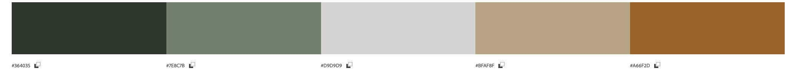

## Wireframe mockups
Initially I utilised Balsamiq to produce low fidelity wireframes to organise the site structure, potential content placement locations.

* [Home page Wireframe](https://github.com/llancruzz/hike-style/blob/main/assets/media/home-page.png)
* [Mission page Wireframe](https://github.com/llancruzz/hike-style/blob/main/assets/media/mission-page.png)
* [Photos page Wireframe](https://github.com/llancruzz/hike-style/blob/main/assets/media/photo-page.png)
* [Join Us page Wireframe](https://github.com/llancruzz/hike-style/blob/main/assets/media/join-us-page.png)
* [Thank You page Wireframe](https://github.com/llancruzz/hike-style/blob/main/assets/media/thank-you-page.png)

## Features

### Common Features 
* Navigation Bar

  * The navigation bar features a common design across all four pages in keeping with convention with a logo on the left hand size and the navigation links on the right.
  * The navigation bar includes links on the logo, Home, Mission, Photos and Join Us. The various title links head to their respective pages for easy navigation. The logo links back to the homepage as a typical shortcut users will likely be familiar with.
  * A horizontal line appears under the current page as a visual indicator to the user as to which page they are currently on. With a line appearing underneath the text on hover to visually indicate to users that they are clickable.
  * A color is activated once you click on each navigation link. This means that the page you clicked was visited.

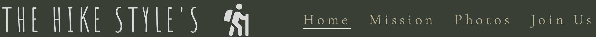 

* Hero Image

  * Only Home page includes a hero image with a text overlay which further indicates to the user exactly which section of the site they are on.

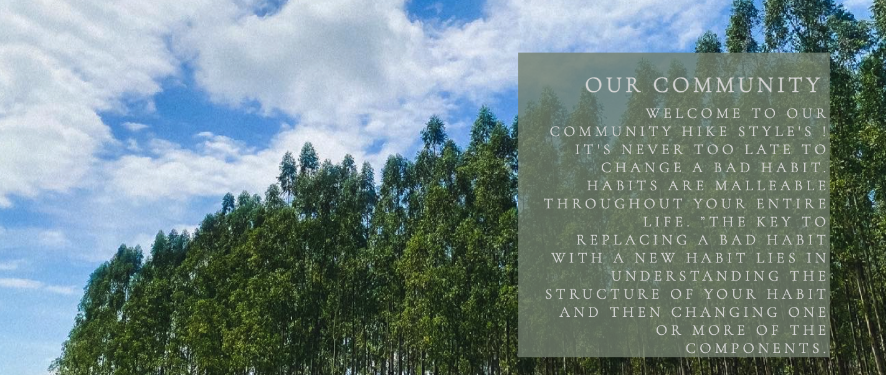

* Footer
  
  * The lower section of the common footer includes logo links to each of the social media platforms. This provides the user with a visual call to action to prompt them into visiting the organisations social media profiles.
  * These links offer an unintrusive method of promoting the social media channels to the user, providing benefits to the organisation by the way of increased social media following.
  * The lower footer section also includes the copyright notice.

### Mission Page Features
* Our Mission

  * The main section of the Mission page includes a text about The Hike Style’s mission. It provides users with the main goal. The mission page contains two images in circle format.

### Photos Page Features
* Our Gallery

  * The photos page allows users to access high-quality photos of each adventurer’s encounters and activates. This allows users to easily identify the types of journey each person has experienced.

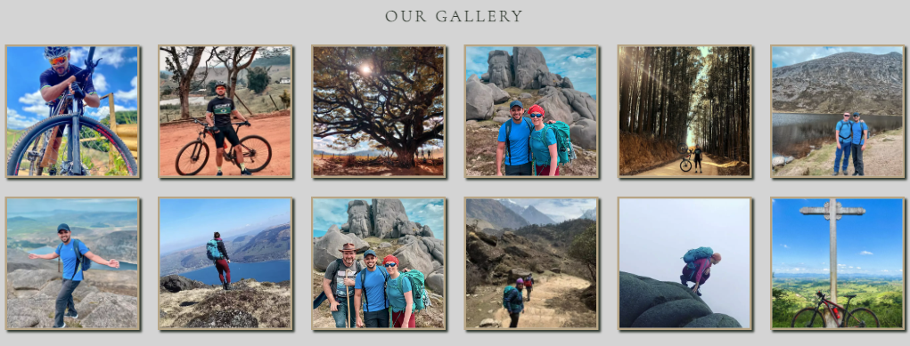

### Join Us Page Features
* Join Us

  * The contact form provides users with the ability to contact The Hike Style's directly with any queries or comments they may have. The user is asked for their full name, email address and a message.

    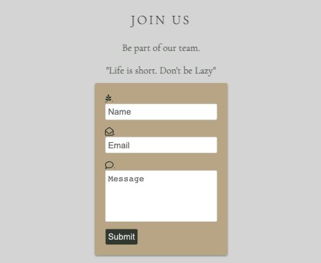

### Thank You Page Features
* Message

  * When submitting the form, the user will be redirected to a new page, which will thank them for subscribing. The page contains a motivational message. No user information will be stored.

    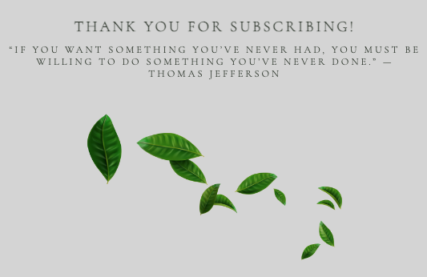

## Technologies
* Technologies Used

  * 
  * 

## Testing

The site has been tested by friends in different browsers ( Chorme, Firefox, Safari) and in different smarthphones, laptop and desktop. I have personally tested the site extensively with development tools to ensure that the site works responsively not only on mobile devices, but also on medium to large screens. I realized that in some sizes for browser Safari, the responsiveness was not 100% complete. I fixed this problem along with some internet searches and Slack Comunnity and realized that I was using enough property position. So I studied deeply how to use Flex-Box and manage to solve the problem. 

### Validator Testing
* HTML

  * No errors were returned when passing through the official W3C Validator.
    
    * [Home Page](https://validator.w3.org/nu/?doc=https%3A%2F%2Fllancruzz.github.io%2Fhike-style%2Findex.html)
    * [Mission Page](https://validator.w3.org/nu/?doc=https%3A%2F%2Fllancruzz.github.io%2Fhike-style%2Fmission.html)
    * [Photos Page](https://validator.w3.org/nu/?doc=https%3A%2F%2Fllancruzz.github.io%2Fhike-style%2Fphotos.html)
    * [Join Us Page](https://validator.w3.org/nu/?doc=https%3A%2F%2Fllancruzz.github.io%2Fhike-style%2Fjoinus.html)
    * [Letter Thank you Page](https://validator.w3.org/nu/?doc=https%3A%2F%2Fllancruzz.github.io%2Fhike-style%2Fletter-submit.html%3Fname%3DAlan%26email%3Dalan.silvacruz%2540hotmail.com%26message%3DHi%26submit%3DSubmit)

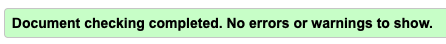

* CSS

  * No errors were returned when passing through the official (Jigsaw) Validator.

    * [Link to results](https://jigsaw.w3.org/css-validator/validator?uri=https%3A%2F%2Fllancruzz.github.io%2Fhike-style%2Findex.html&profile=css3svg&usermedium=all&warning=1&vextwarning=&lang=pt-BR)

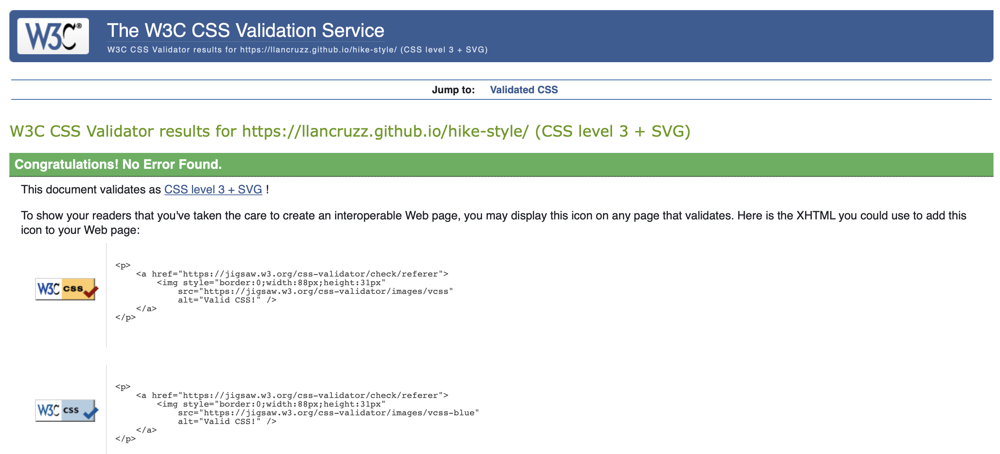

* Lighthouse

  * I generated a lighthouse report for the deployed site through the Google Chrome Dev Tools. I generated both a desktop and mobile report. The two reports, both for mobile and desktop, reported that the image sizes were too heavy to load. I redacted the images and turned them into Webp archive by the site [EZGIF.COM](https://ezgif.com/jpg-to-webp) and then I improved the performance score.

    * Mobile 
    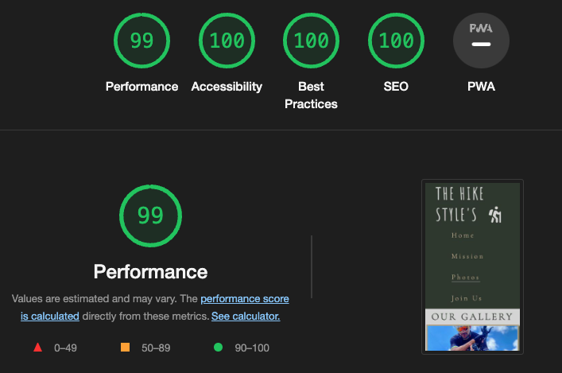

    * Desktop
    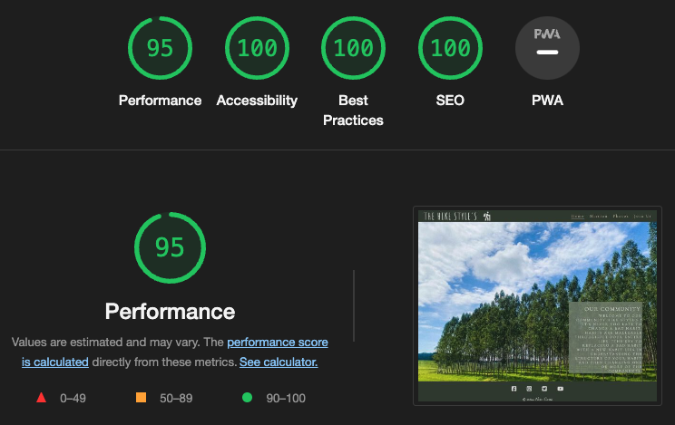
  
* WAVE - Web Accessibility Evaluation Tool

  * I have tested all the pages HOME - MISSION - PHOTOS - JOIN US - THANK YOU for the following analyses: 

  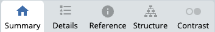

  All the pages no errors were detected! [Link to results](https://wave.webaim.org/report#/https://llancruzz.github.io/hike-style/)

## Deployment
* The site was deployed to GitHub pages. The steps to deploy are as follows:

  * In the GitHub repository, navigate to the settings tab.
  * Select the pages link from the setting menu on the left hand side.
  * Under the GitHub Pages from the source section drop-down menu, select the master branch.
  * One the master branch has been selected, the page will be automatically refreshed with a detailed ribbon display to indicate the successful deployment.

 The live link can be found here - [The Hike Style's Live Site](https://llancruzz.github.io/hike-style/)

 ## Credits & Acknowledgements
 ### Content
  * The text for all pages was created by myself.
  * The reference material on HTML and CSS provided by [w3schools.com](https://www.w3schools.com/) was utilised to implement flexbox and as general reference material for other areas.
  * The logo for footer I used for this project were take from [Font Awesome](https://fontawesome.com/).

 ### Media
  * The images used for hero image on Home Page and Gallery Page were taken by Alan Cruz (myself) and a couple friends. All the images were authorized to be made available in this project by friends.
  * The Favicon, links and meta code were generated by [favicon.io](https://favicon.io/).
  
Lastly, I wanted to thank my friends from community Slack, Matt Bodden, Carina Stenger, which both shared somes important concepts with me. To my mentor Sandeep Aggarwal. To my friend Punith Kumar, which who encouraged me to enter this world of programming code. Finally to my partner Robert Mcculough for his endless patience during the creation of this project.
